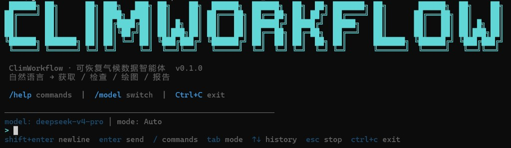
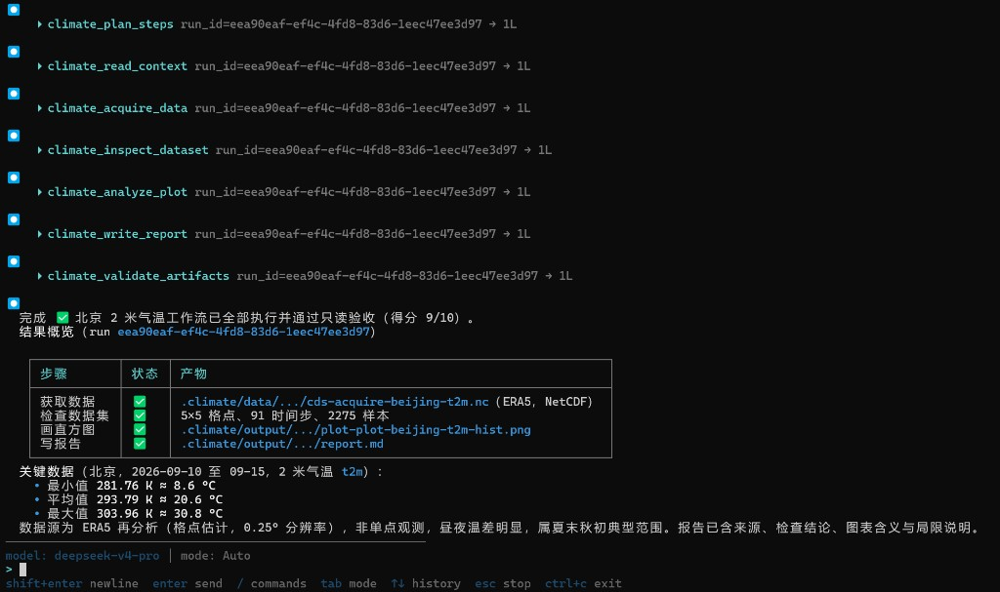
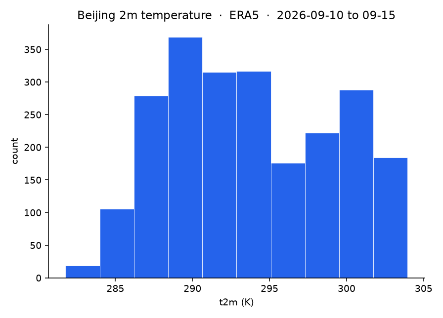
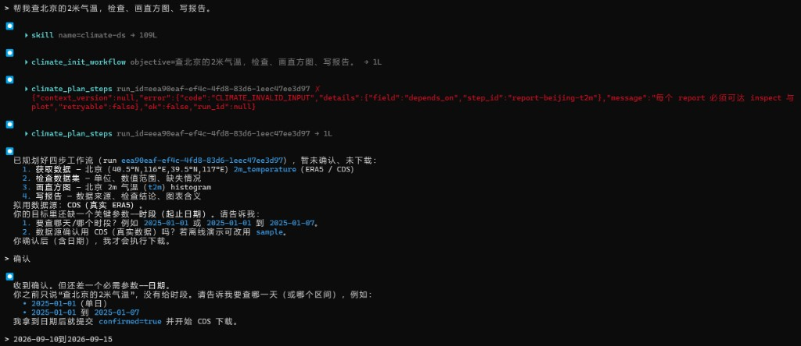
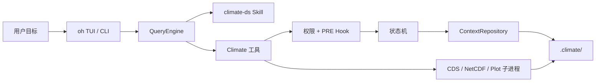

# ClimWorkflow

<p align="center">
  
</p>

<p align="center">
  基于 <a href="https://github.com/HKUDS/OpenHarness">OpenHarness</a> 的可恢复气候数据智能体<br>
  自然语言 → 获取 / 检查 / 绘图 / 报告
</p>

<p align="center">
  <a href="https://github.com/Hongjian01/ClimWorkflow"></a>
  <a href="LICENSE"></a>
  <a href="docs/climate-agent/SPEC.md"></a>
  
</p>

**工具循环、Hook、Skill、权限沙箱复用 OpenHarness。** 领域工具、磁盘 Context、中断恢复、CDS 可靠性与工作区检索是本项目自研（`src/openharness/climate/`）。

独立仓库：[Hongjian01/ClimWorkflow](https://github.com/Hongjian01/ClimWorkflow)。从 OpenHarness fork 的开发记录在 [`feat/climworkflow-mvp`](https://github.com/Hongjian01/OpenHarness/tree/feat/climworkflow-mvp)。

<table>
  <tr>
    <td width="58%" valign="top">
      
    </td>
    <td width="42%" valign="top">
      
    </td>
  </tr>
  <tr>
    <td align="center"><sub>计划确认后跑通获取 / 检查 / 绘图 / 报告（验收 9/10）</sub></td>
    <td align="center"><sub>同一次 run：ERA5 北京 2 米气温，2026-09-10–15</sub></td>
  </tr>
</table>

---

## ✨ 关键能力

| 🔁 可恢复工作流 | 🛡️ 硬顺序与门禁 |
|---|---|
| 进度写入 `.climate/`，不把聊天当权威源。中断后 `climate_read_context` 从磁盘续跑。 | 规划动作仅允许获取 / 检查 / 绘图 / 报告。跳步返回稳定错误码，不执行模型生成的任意代码。 |
| **📋 计划确认** | **📡 真 CDS** |
| `plan` 后须确认才 `acquire`。未确认硬拒绝；改口整表换计划，不往 DAG 里插一步。 | ERA5 走静态目录闸门、有界重试、retrieve 超时与 `.part` 稳定发布。默认 pytest / CI 禁网。 |
| **🧪 科学 IO 隔离** | **📚 诚实检索** |
| NetCDF / matplotlib 在子进程中解析与出图，避免 Windows TUI 被 HDF5 GIL / TkAgg 冻住。 | 可选第九工具为 BM25 + 哈希向量 + RRF。**不是** Chroma / 商用 Embedding。检索不能放行 CDS，也不能代替读 Context。 |

<p align="center">
  
</p>
<p align="center">
  <sub>规划写入后暂停、确认前不下载。第一次提交因 DAG 依赖校验失败被拒绝，修正后再确认。</sub>
</p>

---

## 🤔 解决什么问题

气候分析链路**强顺序、下载有副作用**：任务一长就难中断续跑，模型也容易跳步或把失败说成成功。

ClimWorkflow 把 run 落在工作区磁盘上：状态机管能不能执行，计划闸门管人能不能改口，工具失败返回结构化错误码而不是口头「成功了」。

离线工程路径已人工验收。之后接入真实 CDS、真实模型冒烟、计划确认，以及可选的工作区文档检索。阶段划分与验收口径见 [SPEC](docs/climate-agent/SPEC.md)。

---

## 🏗️ 架构

OpenHarness 提供循环；ClimWorkflow 挂上领域工具与磁盘真相：

```text
openharness/
  engine/            # 复用 — QueryEngine，不改执行语义
  tools/ skills/     # 复用 — 注册表、Skill 加载、权限、Hook
  climate/           # 自研 — 8 个默认气候工具 + 流水线 + 状态机
    pipeline.py      # init / plan / acquire / inspect / plot / report
    state.py         # DAG、幂等、plan_confirmed、中断恢复
    repository.py    # 原子写、文件锁、WAL
    cds.py           # 目录闸门、超时、.part 发布
    netcdf_worker.py # 子进程解析 NetCDF
    plot_worker.py   # 子进程 Agg 出图
  .climate/          # 工作区权威源 — index / runs / data / output
```

### Agent Loop

模型决定**下一步调哪个工具**。Harness 决定**怎么安全执行**：

```python
while True:
    response = await api.stream(messages, tools)
    if response.stop_reason != "tool_use":
        break
    for tool_call in response.tool_uses:
        # Permission → PRE_TOOL_USE → Climate execute → 磁盘 Context
        result = await harness.execute_tool(tool_call)
    messages.append(tool_results)
```

Climate 的 `execute` **不改** `query.py`。同步 CDS / NetCDF / 绘图在领域层卸载到线程或子进程。

### 数据流



主路径：

```text
init → plan → （用户确认）→ acquire → inspect → plot → report → validate
```

| 复用 OpenHarness | 本项目自研 |
|---|---|
| 多步 Tool Calling、入参 Schema、Hook、Skill、路径权限、TUI | 气候工具、RunContext、幂等与冲突、CDS 门禁与弹性、计划确认、工作区检索 |

---

## 🚀 快速开始

需要 Python ≥ 3.10 与 [uv](https://docs.astral.sh/uv/)。离线 Demo **不需要** API Key，也 **不** 访问 CDS。

### 1. 安装

```powershell
git clone https://github.com/Hongjian01/ClimWorkflow.git
cd ClimWorkflow
uv sync --extra dev
```

### 2. 离线回归

```powershell
uv run pytest tests/test_climate -q
```

保持 `CLIMATE_INTEGRATION=0`，除非你有意跑带标记的真实 CDS 测试。

### 3. 一条命令 Demo

在仓库根目录（真实 Climate 工具，无网、无模型）：

```powershell
uv run climworkflow demo --workspace climworkflow-demo
uv run climworkflow resume --workspace climworkflow-demo
```

预期 `climworkflow-demo/.climate/`：

```text
.climate/index.json
.climate/runs/<run_id>/context.json
.climate/data/<run_id>/
.climate/output/<run_id>/*.png 或 *.svg
.climate/output/<run_id>/report.md
```

`report.md` 只用相对路径引用图。脱敏样例见 [examples/offline-demo](examples/offline-demo/)。

### 4. 交互 TUI（截图中的界面）

配置模型后：

```powershell
uv run oh
```

中断后续跑不要猜聊天摘要。权威源是 `climate_read_context`（`climworkflow resume` 只调用它）。Agent 约定见 [`.openharness/skills/climate-ds/SKILL.md`](.openharness/skills/climate-ds/SKILL.md)。

---

## 🔧 默认工具

规划动作面只允许四类 `action`。默认注册 **8** 个 `climate_*` 工具：

| 工具 | 角色 | 作用 |
|---|---|---|
| `climate_init_workflow` | Plan | 创建或显式 resume run |
| `climate_plan_steps` | Plan | 写入 DAG；`confirmed=true` 后才允许下载 |
| `climate_acquire_data` | Data | sample / local / CDS |
| `climate_inspect_dataset` | Coding | CSV / NetCDF / GRIB 有界 profile |
| `climate_analyze_plot` | Coding | 直方图等；优先 PNG |
| `climate_write_report` | Coding | Markdown 报告 |
| `climate_read_context` | Orchestrate | 只读磁盘进度 |
| `climate_validate_artifacts` | Coding | 只读产物规则校验 |

`climate_query_knowledge` 仅 `include_knowledge=True` 时注册。每个工具都有 Pydantic 入参、JSON Schema 与统一错误 envelope。

---

## 📊 评测

```powershell
uv run python -m evals --suite climate --mode real_offline
uv run python -m evals --suite climate --mode synthetic_dry_run
uv run ruff check src tests scripts evals
```

| 模式 | 证明什么 | 计入真实通过率 |
|---|---|---|
| `real_offline` | 真实 Climate 工具，无网、无模型 | 是 |
| `synthetic_dry_run` | 只跑场景解析与断言接线 | 否 |
| `real_agent` | 固定模型 + 真实工具 + CDS，需 `--agent-config` | 三次运行且至少两次硬断言通过后才算 |

四场景 `real_offline`（含 `sample_pipeline` 与 Hook 场景）`real_pass_rate=1.0`。`pre_tool_output_guard` 在 `execute` 前拦截，错误码 `CLIMATE_HOOK_BLOCKED`。

可选真实模型（密钥不入库）：

```powershell
uv run python -m evals --suite climate --mode real_agent `
  --agent-config evals/configs/climate-real.json `
  --runs 3 `
  --baseline-out evals/baselines/climate-real-<commit>.json
```

未提供 `--agent-config` 时，套件拒绝 `real_agent`（`CLIMATE_DEPENDENCY_MISSING`）。

工作区检索召回（离线，默认不注册第九工具）：

```powershell
uv run python -m evals --suite climate --mode real_offline --scenario knowledge_alias_smoke
uv run python scripts/climate_knowledge_recall.py
```

### 常见错误码

| 码 | 含义 |
|---|---|
| `CLIMATE_INVALID_PATH` | 路径逃逸或写区违规 |
| `CLIMATE_INVALID_INPUT` | Schema / 字段错误 |
| `CLIMATE_INVALID_TRANSITION` | 非法状态转换；未确认计划时 `reason=plan_unconfirmed` |
| `CLIMATE_DEPENDENCY_NOT_READY` | 非法工具顺序 |
| `CLIMATE_HOOK_BLOCKED` | `PRE_TOOL_USE` 阻断 execute |
| `CLIMATE_IDEMPOTENCY_CONFLICT` | 同一步换了输入 |
| `CLIMATE_EXTERNAL_TIMEOUT` / `RATE_LIMIT` | 可重试的 CDS 超时 / 429（最多 3 次） |
| `CLIMATE_RECOVERY_REQUIRED` | 只读工具看见未完成 WAL，自己不修盘 |

---

## 📌 已知限制

- 离线 Demo 不要求 CDS 或在线模型。不要把 `synthetic_dry_run` 当成真实执行。
- CDS 仅静态合法清单（`reanalysis-era5-single-levels` + 冻结变量）。
- 不是通用 DAG 调度器，也不是任意 NetCDF/GRIB 科学计算栈。
- 工作区外路径一律拒绝。
- `full_auto` 下模型仍可能自己 `confirmed=true`；硬闸门只保证「没有确认事件就不能下载」。
- 全仓库 `pytest -q` 在 Windows 上仍可能有上游 OpenHarness 环境失败；气候回归以 `tests/test_climate` 为准。
- 未合入上游 HKUDS。Fork CI 曾于 2026-09-02 在 Python 3.10/3.11、Ruff、frontend typecheck 全绿（[run 33604624255](https://github.com/Hongjian01/OpenHarness/actions/runs/33604624255)）。
- 不要提交密钥、`.cdsapirc`、下载的 ERA5、`.part`、缓存或 `evals/reports/*.json`。

阶段编号与门禁细节见 [SPEC](docs/climate-agent/SPEC.md)。

---

## 📄 文档

- 规格：[docs/climate-agent/SPEC.md](docs/climate-agent/SPEC.md)
- 开发手册：[docs/climate-agent/GREENFIELD_DEVELOPMENT_GUIDE.md](docs/climate-agent/GREENFIELD_DEVELOPMENT_GUIDE.md)
- 未实现点：[docs/ClimateWorkFlow未实现点.md](docs/ClimateWorkFlow未实现点.md)
- 上游 Runtime：[README.openharness.md](README.openharness.md)

---

## 🤝 贡献与许可

开发与验收约定见 SPEC。请勿把真实 CDS 产物、凭证或简历草稿推进仓库。

MIT，见 [LICENSE](LICENSE)。LICENSE 保留上游 OpenHarness 版权声明；本仓库在其上增加气候领域层。OpenHarness 版权归 [HKUDS/OpenHarness](https://github.com/HKUDS/OpenHarness)。
