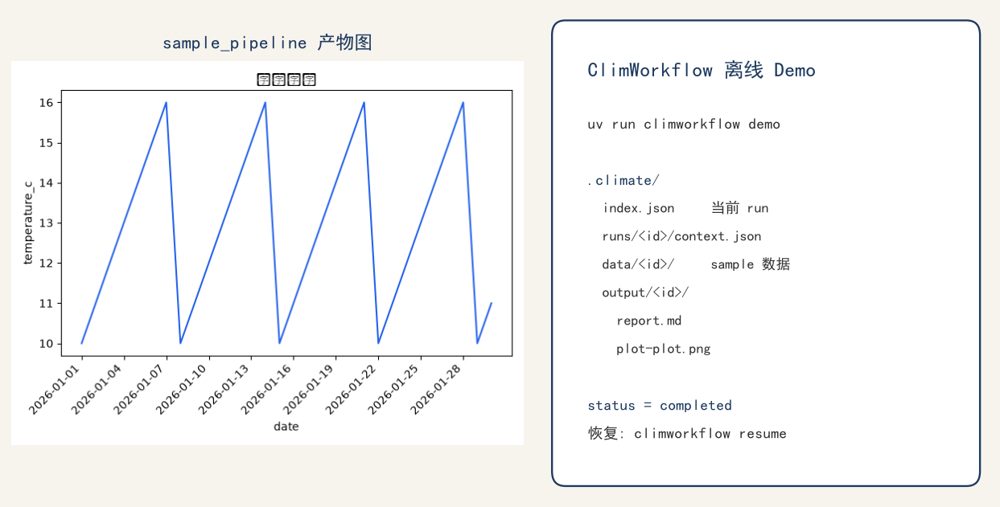

# ClimWorkflow

<p align="center">
  
</p>

基于 [OpenHarness](https://github.com/HKUDS/OpenHarness) 的**可恢复气候数据智能体**。自然语言目标经 Tool Calling 完成获取、检查、绘图与报告。

**工具循环、Hook、Skill 加载、权限沙箱复用 Runtime**；领域工具、磁盘上下文、中断恢复、CDS 可靠性与工作区检索是本项目自研（`src/openharness/climate/`）。

独立仓库：[github.com/Hongjian01/ClimWorkflow](https://github.com/Hongjian01/ClimWorkflow)。从 OpenHarness fork 的开发记录在 [`feat/climworkflow-mvp`](https://github.com/Hongjian01/OpenHarness/tree/feat/climworkflow-mvp)。

[上游 OpenHarness 英文 README](README.openharness.md) · [上游中文说明](README.zh-CN.md) · [规格 SPEC](docs/climate-agent/SPEC.md) · [示例产物](examples/offline-demo/)

---

## 解决什么问题

气候分析链路**强顺序、下载有副作用**：任务一长就难中断续跑，模型也容易跳步或把失败说成成功。ClimWorkflow 把进度落在工作区 `.climate/`，不把聊天记录当权威源。

Day 10（2026-08-28）人工验收后，G0～G3 称谓为 **ClimWorkflow Offline Engineering MVP**。后续阶段已接入真实 CDS、真实模型冒烟，以及可选的工作区文档检索。

## 架构边界

```text
OpenHarness QueryEngine（不改语义）
  → 8 个默认 Climate 工具（7 业务 + 1 只读验收）
      → 流水线 + 状态机
          → ContextRepository（原子写、文件锁、WAL）
              → .climate/  index / runs / data / output
  → climate-ds Skill（先规划再执行；中断后先读磁盘）
  → PRE_TOOL_USE Hook
  → 可选：CDS 下载、NetCDF/GRIB、第九工具 climate_query_knowledge
```

| 复用 OpenHarness | 本项目自研 |
|---|---|
| 多步 Tool Calling、入参 Schema、Hook、Skill、路径权限 | 气候工具、RunContext、幂等与冲突、CDS 门禁与弹性、工作区检索 |

规划动作面只允许：获取、检查、绘图、报告。非法跳步返回稳定错误码。不执行模型生成的任意代码。

## 默认工具

| 工具 | 作用 |
|---|---|
| `climate_init_workflow` | 初始化或恢复 run |
| `climate_plan_steps` | 规划四类动作 |
| `climate_acquire_data` | sample / local / CDS |
| `climate_inspect_dataset` | CSV / NetCDF / GRIB |
| `climate_analyze_plot` | 出图 |
| `climate_write_report` | Markdown 报告 |
| `climate_read_context` | 只读磁盘进度（恢复权威源） |
| `climate_validate_artifacts` | 只读产物规则校验 |

`climate_query_knowledge` 仅 `include_knowledge=True` 时注册，默认不进入工具表。检索命中**不能**放行 CDS 下载，也**不能**代替 `climate_read_context`。工作区检索是 BM25 + 哈希向量 + RRF，**不是** Chroma / 商用 Embedding。

## 快速开始

需要 Python ≥ 3.10 与 [uv](https://docs.astral.sh/uv/)。离线演示**不需要** API Key，也**不**访问 CDS。

```powershell
uv sync --extra dev
uv run pytest tests/test_climate -q
```

保持 `CLIMATE_INTEGRATION=0`，除非你有意跑带标记的真实 CDS 测试。

### 一条命令：空 workspace Demo（`sample_pipeline`）

在仓库根目录执行（真实 Climate 工具，无网、无模型）：

```powershell
uv run climworkflow demo --workspace climworkflow-demo
uv run climworkflow resume --workspace climworkflow-demo
```

`demo` 内部跑 `sample_pipeline`。预期 `climworkflow-demo/.climate/`：

```text
.climate/index.json
.climate/runs/<run_id>/context.json
.climate/data/<run_id>/
.climate/output/<run_id>/*.png 或 *.svg
.climate/output/<run_id>/report.md
```

`report.md` 只用相对路径引用图，不得出现工作区绝对路径。脱敏样例见 [examples/offline-demo](examples/offline-demo/)。

本地 CSV 检查（`cached_inspect`，状态为 `running`，无图/报告）仍可用评测场景；主路径请用上面的 `climworkflow demo`。

### 模拟新会话：只从磁盘恢复

不要根据聊天摘要猜测成功。权威源是 `climate_read_context`（`climworkflow resume` 只调用它）：

```powershell
uv run climworkflow resume --workspace climworkflow-demo
```

Agent 指导见 [`.openharness/skills/climate-ds/SKILL.md`](.openharness/skills/climate-ds/SKILL.md)。

## 评测

```powershell
uv run python -m evals --suite climate --mode real_offline
uv run python -m evals --suite climate --mode synthetic_dry_run
uv run ruff check src tests scripts evals
```

| 模式 | 证明什么 | 计入真实通过率 |
|---|---|---|
| `real_offline` | 真实 Climate 工具，无网、无模型 | 是 |
| `synthetic_dry_run` | 只跑场景解析与断言接线 | 否 |
| `real_agent` | 固定模型 + 真实工具 + CDS，需 `--agent-config` | 三次运行且至少两次硬断言通过后才算 |

四场景 `real_offline`（含 `sample_pipeline` 与 Hook 场景）`real_pass_rate=1.0`。`pre_tool_output_guard` 在 `execute` 前拦截，错误码 `CLIMATE_HOOK_BLOCKED`。

可选真实模型（密钥不入库）：

```powershell
uv run python -m evals --suite climate --mode real_agent `
  --agent-config evals/configs/climate-real.json `
  --runs 3 `
  --baseline-out evals/baselines/climate-real-<commit>.json
```

无 `--agent-config` 时 G3 仍拒绝 `real_agent`（`CLIMATE_DEPENDENCY_MISSING`）。

工作区检索召回（离线，默认不注册第九工具）：

```powershell
uv run python -m evals --suite climate --mode real_offline --scenario knowledge_alias_smoke
uv run python scripts/climate_knowledge_recall.py
```

## 常见错误码

| 码 | 含义 |
|---|---|
| `CLIMATE_INVALID_PATH` | 路径逃逸或写区违规 |
| `CLIMATE_INVALID_INPUT` | Schema / 字段错误 |
| `CLIMATE_DEPENDENCY_NOT_READY` | 非法工具顺序 |
| `CLIMATE_HOOK_BLOCKED` | `PRE_TOOL_USE` 阻断 execute |
| `CLIMATE_DEPENDENCY_MISSING` | 缺可选依赖，或 `real_agent` 未给 `--agent-config` |
| `CLIMATE_IDEMPOTENCY_CONFLICT` | 同一步换了输入 |
| `CLIMATE_EXTERNAL_TIMEOUT` | 可重试的 CDS 超时（最多 3 次） |
| `CLIMATE_EXTERNAL_RATE_LIMIT` | 可重试的 CDS 429（最多 3 次） |
| `CLIMATE_RECOVERY_REQUIRED` | 只读工具看见未完成 WAL，自己不修盘 |

## 已知限制

- 离线 Demo（G0～G3）不要求 CDS 或在线模型。不要把 `synthetic_dry_run` 当成真实执行。
- G4 CDS 有静态合法清单（`reanalysis-era5-single-levels` + 冻结变量）。默认 pytest / CI 禁网（`CLIMATE_INTEGRATION=0`）。
- 不是通用 DAG 调度器，也不是任意 NetCDF/GRIB 科学计算栈。
- 工作区外路径一律拒绝。
- 全仓库 `pytest -q` 在 Windows 上仍可能有上游 OpenHarness 环境失败；气候回归以 `tests/test_climate` 为准。
- 未合入上游 HKUDS。Fork CI 曾于 2026-09-02 在 Python 3.10/3.11、Ruff、frontend typecheck 全绿（[run 33604624255](https://github.com/Hongjian01/OpenHarness/actions/runs/33604624255)）。
- 不要提交密钥、`.cdsapirc`、下载的 ERA5、`.part`、缓存或 `evals/reports/*.json`。

## 文档

- 规格：[docs/climate-agent/SPEC.md](docs/climate-agent/SPEC.md)
- 开发手册：[docs/climate-agent/GREENFIELD_DEVELOPMENT_GUIDE.md](docs/climate-agent/GREENFIELD_DEVELOPMENT_GUIDE.md)
- 上游 Runtime：[README.openharness.md](README.openharness.md)

## License

MIT，见 [LICENSE](LICENSE)。OpenHarness 版权归上游 [HKUDS/OpenHarness](https://github.com/HKUDS/OpenHarness)。
