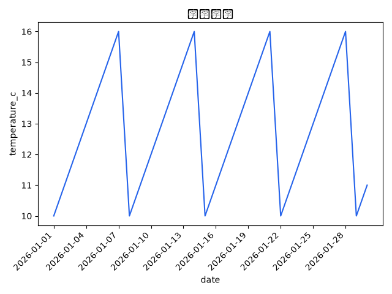

# 示例气候报告

- objective: 分析示例温度序列并生成报告
- mode: sample

## Inspect
- row_count: 30
- columns: date, temperature_c, precipitation_mm

## Plot

## Summary
离线 sample 流水线完成。由 `uv run climworkflow demo` 生成；进度在 `.climate/`，聊天记录不是权威源。
